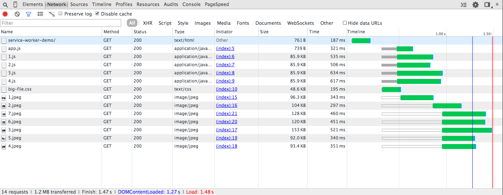
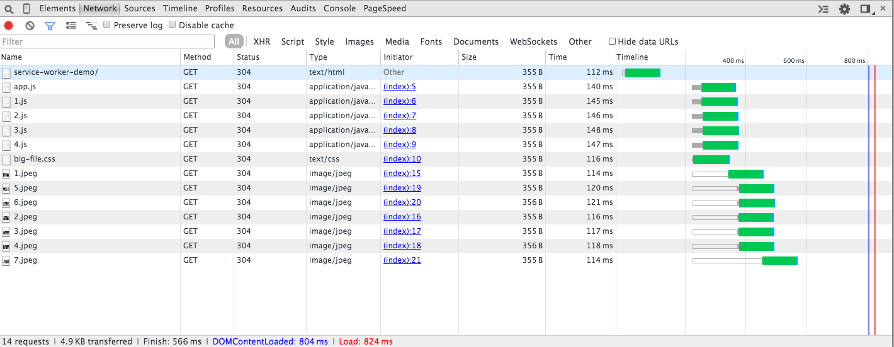

Service Worker Demo
===

[Service Worker Introduction](http://www.html5rocks.com/en/tutorials/service-worker/introduction/)

Current Support
---
[Is it ready yet?](https://jakearchibald.github.io/isserviceworkerready/index.html)

Gotchas
--

- Requires HTTPS
- Fetching resources xdomain requires CORS enabled on target server (no-CORS option on request causes 'opaque response' - no determining fate)
- fetch() doesnt follow 30x redirects
- If hash is changed, [Chrome kills the worker](https://code.google.com/p/chromium/issues/detail?id=433708)

Responsive Images
---

- When caching low res images, remember to set explicit width and height on img node, as the node is unaware if the request has fallen back to a cached image of a different size.

Results
---

- index.html contains ~1.2MB of assets (images, js, css)
- *Disabled test*: [load over HTTP](http://andyshora.github.io/service-worker-demo/)
- Average page load: 1300ms. 1.2MB downloaded.

- *Enabled test*: [load over HTTPS](https://andyshora.github.io/service-worker-demo/)
- Average page load: 800ms. 4KB downloaded.

